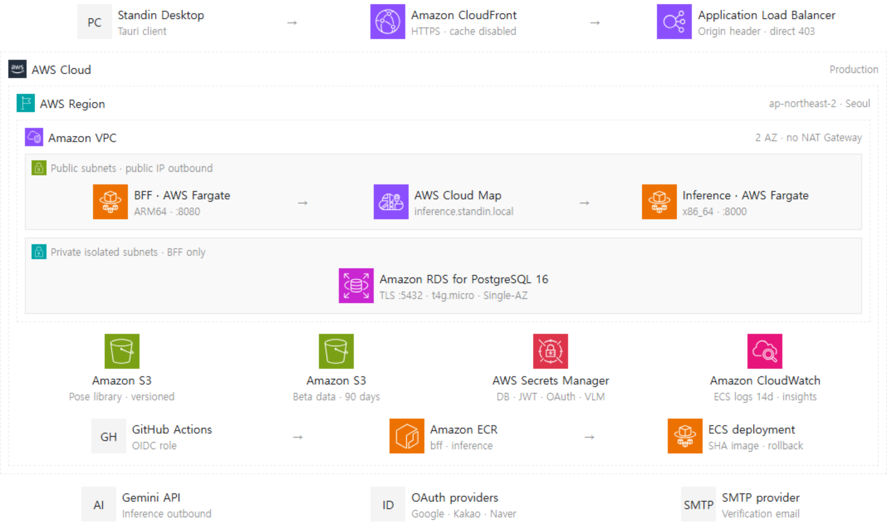

# Standin 인프라 (AWS CDK)

Standin의 AWS 인프라를 코드로 관리한다. 두 서비스(BFF·추론)를 함께 배포하므로 앱 저장소와 분리했다.

## 현재 AWS 아키텍처

[](docs/architecture/standin-aws-architecture.html)

> `Standin-infra`의 현재 CDK 선언 기준이다. CloudWatch는 ECS 컨테이너 로그(14일 보존)와 Container Insights만 구성되어 있으며, 대시보드·알람·SNS 알림은 아직 없다. 이미지를 클릭하면 확대 가능한 다이어그램을 볼 수 있다.

## 스택 구성

| 스택 | 내용 | 왜 분리했나 |
|---|---|---|
| `StandinRegistry` | ECR 저장소 2개 | 이미지는 앱보다 오래 산다. 앱 스택을 지워도 롤백 대상이 남아야 한다 |
| `StandinCicd` | GitHub OIDC 공급자 + 배포 역할 | 앱 스택보다 먼저 있어야 CI가 이미지를 밀어 넣을 수 있다 |
| `StandinApp` | VPC·보안그룹·RDS·ECS·ALB·S3·시크릿 | 아래 참고 |

**네트워크·DB·서비스를 한 스택에 둔 이유**: 보안그룹이 세 영역에 걸쳐 서로를 참조한다(ALB → BFF → 추론/DB). 스택을 나누면 CDK가 리스너·타깃을 붙이며 보안그룹 규칙을 자동 추가하는 지점에서 순환 의존이 계속 생긴다. 이 규모에서는 한 스택이 더 단순하고 안전하다.

## 설계 결정

- **NAT Gateway 없음** (월 ~$32 절약). 태스크는 퍼블릭 서브넷 + 퍼블릭 IP로 외부(VLM API·S3)에 나가고, 인바운드는 보안그룹으로 막는다. RDS는 isolated 서브넷이라 인터넷에서 닿지 않는다.
- **공개 경계는 BFF 하나뿐.** 추론 서버는 무인증이므로(`Standin-server/docs/API_CONTRACT.md`) ALB에 붙이지 않고 Cloud Map 내부 DNS(`inference.standin.local`)로만 노출한다. 보안그룹도 BFF에서 오는 8000만 연다.
- **도메인 없이 HTTPS.** CloudFront 기본 `*.cloudfront.net` 인증서를 공개 진입점으로 쓴다. API 캐시는 끄고 모든 메서드·헤더·쿠키·쿼리스트링을 BFF로 전달한다. ALB는 CloudFront가 붙이는 비밀 헤더가 없는 요청을 403으로 거부한다.
- **BFF는 arm64(Graviton), 추론은 x86_64.** BFF는 같은 성능에 더 싸고, 추론은 ONNX 런타임 호환성을 위해 x86을 유지한다.
- **자격증명은 코드에 없다.** DB 비밀번호는 CDK가 Secrets Manager에 생성하고, JWT 키도 자동 생성한다. 태스크는 IAM 역할로 S3를 읽는다.
- **GPU 전환 경로.** 포즈 백엔드를 GPU로 올리면 추론 서비스만 EC2 캐패시티 프로바이더로 옮긴다. 클러스터·ALB·BFF는 그대로다. Fargate는 GPU를 지원하지 않는다.

## 배포는 2단계로 나눈다

`appEnv` 컨텍스트 하나로 전환한다. 코드를 고치지 않는다.

| | 1단계 `development` (기본) | 2단계 `production` |
|---|---|---|
| 포즈 라이브러리 | 합성(자동 생성) | S3 번들 — 없으면 **기동 실패** |
| VLM · 포즈 백엔드 | mock | gemini · rtmlib — mock으로 폴백하면 **기동 실패** |
| 목적 | ALB·RDS·서비스 디스커버리·시크릿 주입·CI 배선 검증 | 실서비스 |

1단계는 실 라이브러리도 API 키도 없이 뜬다. **인프라가 실제로 물리는지 먼저 확인하고**, 준비되면 2단계로 넘어간다.

```bash
npm install
npx cdk bootstrap                      # 계정·리전당 1회

npx cdk deploy StandinRegistry         # 1. 이미지 저장소
npx cdk deploy StandinCicd             # 2. CI 역할 → 출력된 ARN을 GitHub 변수에 등록
#    → 앱 저장소에서 워크플로를 돌려 이미지를 먼저 밀어 넣는다(templates/ 참고)
npx cdk deploy StandinApp              # 3. 1단계 기동

# … 검증 후, 라이브러리·키가 준비되면
npx cdk deploy StandinApp -c appEnv=production
```

`StandinApp`은 ECR에 `latest` 태그가 있어야 태스크가 기동한다. **2번과 3번 사이에 이미지 푸시가 반드시 들어간다.**

배포 후 출력되는 `CloudFrontUrl`을 `cdk.json`의 `publicUrl`에 채우고 `StandinApp`을 다시 배포한다. OAuth 콜백과 이메일 인증 링크가 이 HTTPS 값을 쓴다.

```bash
npx cdk deploy StandinApp
# 출력 예: CloudFrontUrl=https://dxxxxxxxxxxxxx.cloudfront.net

npx cdk deploy StandinApp -c publicUrl=https://dxxxxxxxxxxxxx.cloudfront.net
```

클라이언트의 API 기준 URL과 각 OAuth provider의 Redirect URI도 `CloudFrontUrl`을 사용한다. `AlbUrl`은 CloudFront origin 확인용 출력이며 직접 호출하면 403이 정상이다.

BFF는 OAuth 성공 시 `OAUTH_SUCCESS_REDIRECT=standin://auth/callback`으로 리디렉트한다. URL에는 토큰 대신 1회용 교환 코드만 담기며, 데스크톱 앱이 `/v1/auth/oauth/exchange`로 토큰을 받아간다.

운영 가입 페이지 `https://standin-seven.vercel.app`은 BFF의 `CORS_ORIGINS`에 허용돼 있다. Vercel의 `VITE_API_BASE_URL`은 `CloudFrontUrl`로 설정하며, Origin 비교가 정확히 일치하도록 Vercel 주소 끝에는 `/`를 붙이지 않는다.

## 배포 전에 끝내야 할 것

### 1. BFF의 DB 접속 방식 — ✅ 완료

CDK는 RDS가 만든 시크릿을 **표준 `PG*` 변수**로 주입한다(`PGHOST`/`PGPORT`/`PGUSER`/`PGPASSWORD`/`PGDATABASE`). 접속 문자열을 따로 조립해 보관하지 않기 위해서다 — 시크릿을 두 벌로 만들면 회전할 때 어긋난다.

BFF(`feat/postgres`)는 `PGHOST`가 있으면 `connectionString`을 넘기지 않아 `pg`가 `PG*`를 읽는다. 로컬은 `PGHOST`가 없으므로 `DATABASE_URL` 기본값이 그대로 쓰인다.

**단, 이 코드는 아직 `feat/postgres` 브랜치에 있다. main에 머지돼야 배포할 수 있다.**

### 2. 포즈 라이브러리 번들 업로드 (2단계)

`Standin-server` 저장소의 배포 스크립트를 쓴다. 검증 → 압축 → 업로드 → 재기동 → 확인을
한 번에 하고, 번들이 잘못됐으면 업로드 자체를 막는다.

```bash
python scripts/deploy_pose_library.py data/
```

업로드하지 않으면 추론 태스크가 기동에 실패한다(프로덕션에서는 합성 라이브러리로 대체하지 않는다).

수동으로 만들 때는 `thumbs`를 빠뜨리지 않는다 — 빠져도 에러가 나지 않고 썸네일만 조용히 사라진다.

```bash
tar -czf v1.tar.gz -C data poses.db index.pkl bvh thumbs
aws s3 cp v1.tar.gz s3://<AssetsBucketName>/pose-library/v1.tar.gz
```

버킷 이름은 `StandinApp` 출력에서 확인한다.

`requirements.txt`의 `boto3` 주석도 해제해야 `s3://`를 받을 수 있다.

#### 추론 서버 담당자 IAM 설정

`StandinApp`은 `standin-inference-operator` 관리형 정책을 함께 만든다. 이 정책은
`pose-library/` 아래의 업로드·조회와 해당 추론 ECS 서비스의 조회·재기동만 허용한다.
버킷의 다른 경로, 객체 삭제, 다른 ECS 서비스 변경 권한은 포함하지 않는다.

사람별 IAM 사용자나 장기 액세스 키를 새로 만들지 말고, IAM Identity Center에서 추론 팀
그룹용 권한 세트를 만든 뒤 출력된 `InferenceOperatorPolicyArn`의 고객 관리형 정책
`standin-inference-operator`를 연결한다. 기존 사내 운영 역할을 쓰는 경우에는 그 역할에
같은 정책을 연결해도 된다.

담당자는 SSO로 로그인한 뒤 번들을 업로드하고 추론 서비스만 새로 배포한다.

```bash
aws configure sso --profile standin-inference    # 최초 1회
aws sso login --profile standin-inference

python scripts/deploy_pose_library.py data/      # 검증·업로드·재기동·확인
python scripts/deploy_pose_library.py --rollback # 직전 번들로 되돌리기
```

버킷·클러스터·서비스 이름은 스크립트에 기본값으로 들어 있다. 스택을 다시 만들어 이름이
바뀌면 `POSE_LIBRARY_BUCKET`·`ECS_CLUSTER`·`ECS_SERVICE` 환경변수로 덮어쓴다. 값은
`aws cloudformation describe-stacks --stack-name StandinApp` 출력에서 확인한다.

버킷 버전 관리가 켜져 있으므로 같은 키로 새 번들을 올려도 이전 버전은 보존된다 —
`--rollback`이 그 버전을 찾아 되돌린다. 실행 중 Fargate 컨테이너에 직접 복사한 파일은
태스크 교체 시 사라지므로 운영 절차로 사용하지 않는다.

자세한 담당자 안내는 [INFERENCE_OPERATOR_GUIDE.md](INFERENCE_OPERATOR_GUIDE.md) 참고.

### 3. 소셜 로그인 키

`standin/oauth` 시크릿에는 **키 6개가 빈 값으로 이미 만들어져 있다.** 콘솔에서 값만 채우면 된다.

키를 미리 만들어 두는 이유: ECS는 태스크를 띄울 때 시크릿의 JSON 키를 해석하는데, 없는 키를 참조하면 컨테이너가 시작조차 못 한다. 값이 비어 있으면 앱이 `PROVIDER_UNAVAILABLE`로 처리하므로 기동에는 문제가 없다 — 소셜 로그인만 비활성이다.

각 provider 콘솔의 Redirect URI도 `{AlbUrl}/v1/auth/oauth/{provider}/callback`로 등록한다.

### 4. VLM API 키 (2단계)

`standin/vlm` 시크릿의 `geminiApiKey`에 값을 채운다. 배선은 이미 돼 있다.

값이 비면 추론 서버가 조용히 mock으로 폴백하는데, 런타임 가드가 그걸 잡아 기동을 막는다 — 가짜 후보가 서빙되는 일은 없다.

### 5. 이메일 인증 SMTP

`standin/smtp` 시크릿에 아래 값을 채운다. Gmail SMTP, SES SMTP 등 표준 SMTP 공급자를 사용할 수 있다.

| 키 | 예시 |
|---|---|
| `host` | `smtp.gmail.com` |
| `port` | `587`(STARTTLS) 또는 `465`(TLS) |
| `user` | SMTP 사용자명 |
| `pass` | SMTP 비밀번호 또는 앱 비밀번호 |
| `from` | `Standin <인증된-발신주소>` |

시크릿 값을 바꾼 뒤에는 BFF ECS 서비스를 강제 재배포해야 새 태스크가 값을 읽는다. 개인 Gmail을 쓸 경우 일반 계정 비밀번호가 아니라 앱 비밀번호를 사용한다. SES SMTP를 쓸 경우 SES 콘솔에서 별도로 발급한 SMTP 자격증명을 사용하며 IAM 액세스 키를 그대로 넣지 않는다.

## CI/CD

`templates/`의 워크플로를 각 앱 저장소의 `.github/workflows/deploy.yml`로 복사한다.

- `deploy-bff.yml` → `Standin-app-server`
- `deploy-inference.yml` → `Standin-server`

저장소 변수 두 개가 필요하다(Settings → Secrets and variables → Actions → Variables):

| 변수 | 값 |
|---|---|
| `AWS_REGION` | `ap-northeast-2` |
| `AWS_DEPLOY_ROLE` | `StandinCicd` 스택의 `DeployRoleArn` 출력 |

장기 액세스 키를 만들지 않는다 — GitHub이 실행마다 발급하는 OIDC 토큰으로 역할을 assume한다.

## 비용 (서울 리전 대략, 유휴 기준)

| 항목 | 월 |
|---|---|
| Fargate BFF (0.5 vCPU / 1 GB, arm64) | ~$15 |
| Fargate 추론 (1 vCPU / 2 GB) | ~$36 |
| ALB | ~$16 |
| RDS t4g.micro + 20GB | ~$12 (첫 12개월 프리티어 가능) |
| S3 · ECR · CloudWatch · Secrets Manager | ~$3 |
| **합계** | **~$80** |

NAT Gateway를 뺀 구성이다. 넣으면 ~$32가 더 든다.

## 알려진 한계

- **CloudFront→ALB 구간은 HTTP.** 사용자→CloudFront는 공인 HTTPS지만 origin 구간은 아직 HTTP다. 도메인이 준비되면 ALB에 ACM 인증서를 붙이고 CloudFront origin policy를 `HTTPS_ONLY`로 바꾼다.
- **단일 태스크·단일 AZ.** `desiredCount: 1`, RDS `multiAz: false`. 가용성이 필요해지면 올린다.
- **Job 유실.** BFF의 분석 Job이 아직 프로세스 내 fire-and-forget이라 배포·태스크 교체 시 진행 중 작업이 사라진다. SQS로 옮기기 전까지의 감수 사항이다.
- **RDS `removalPolicy: SNAPSHOT`, `deletionProtection: false`.** 초기 단계 설정이다. 실사용자가 생기면 `RETAIN` + 삭제 보호로 바꿀 것.
- **환경 분리 없음.** dev/prod 스택을 따로 두지 않았다. `appEnv`는 같은 스택의 동작만 바꾼다. 두 환경을 동시에 띄우려면 스택 이름을 환경별로 나눠야 한다.
- **SMTP 공급자 운영 설정 필요.** 인프라 배선은 `standin/smtp`로 완료돼 있지만 실제 발신 계정과 주소는 별도로 준비해야 한다. SES를 선택하면 프로덕션 액세스 신청과 발신 주소 인증에 시간이 걸릴 수 있다.
